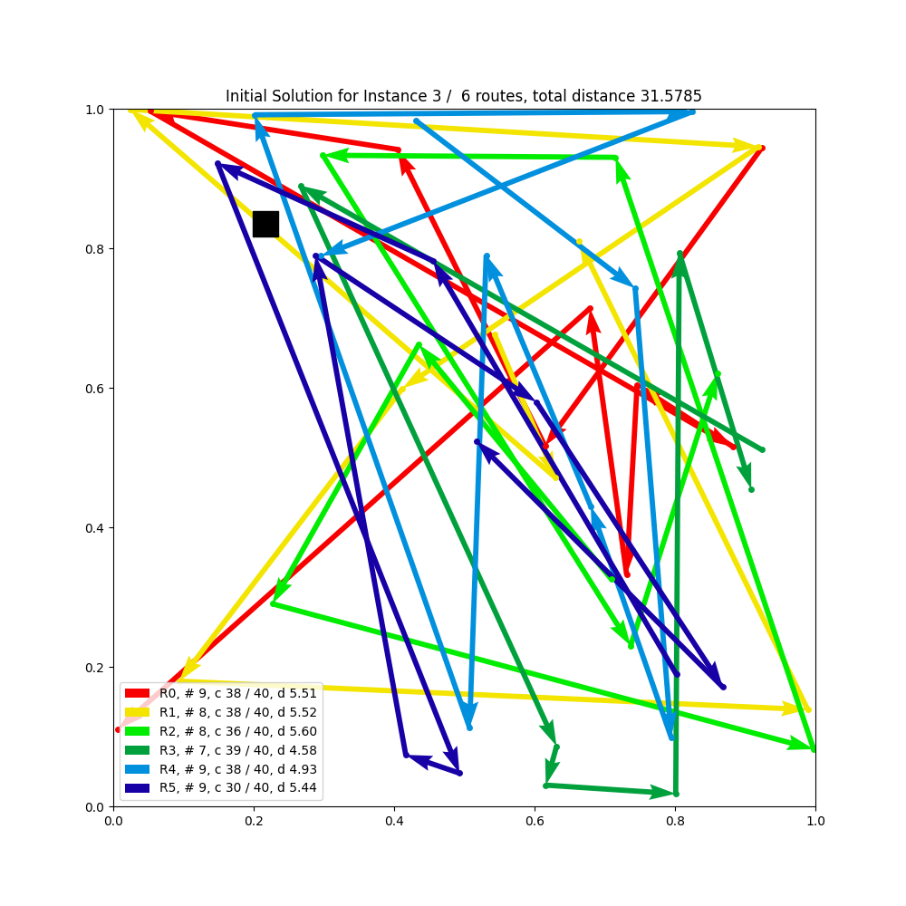
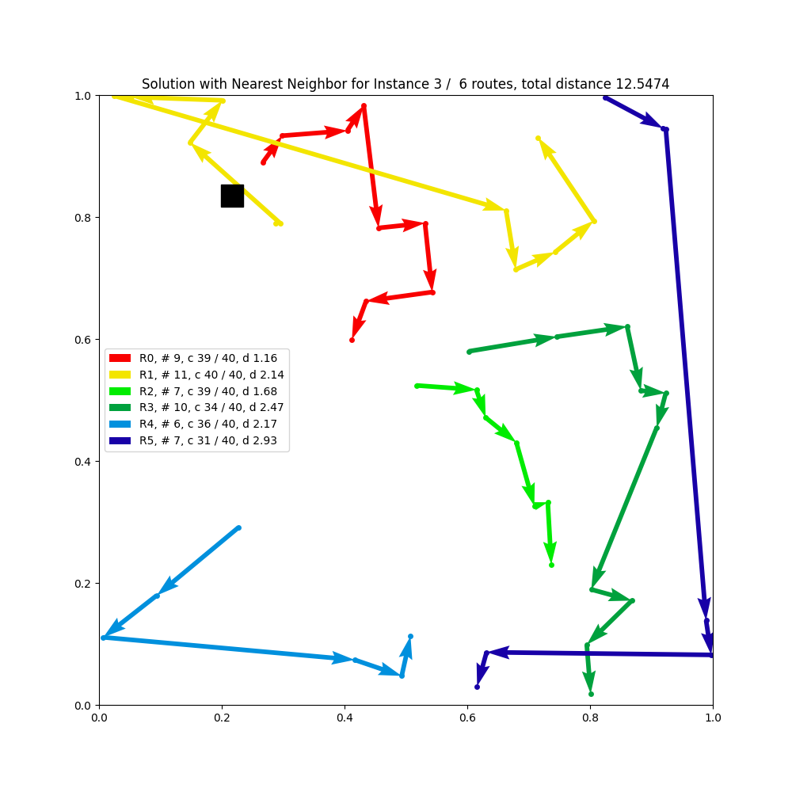
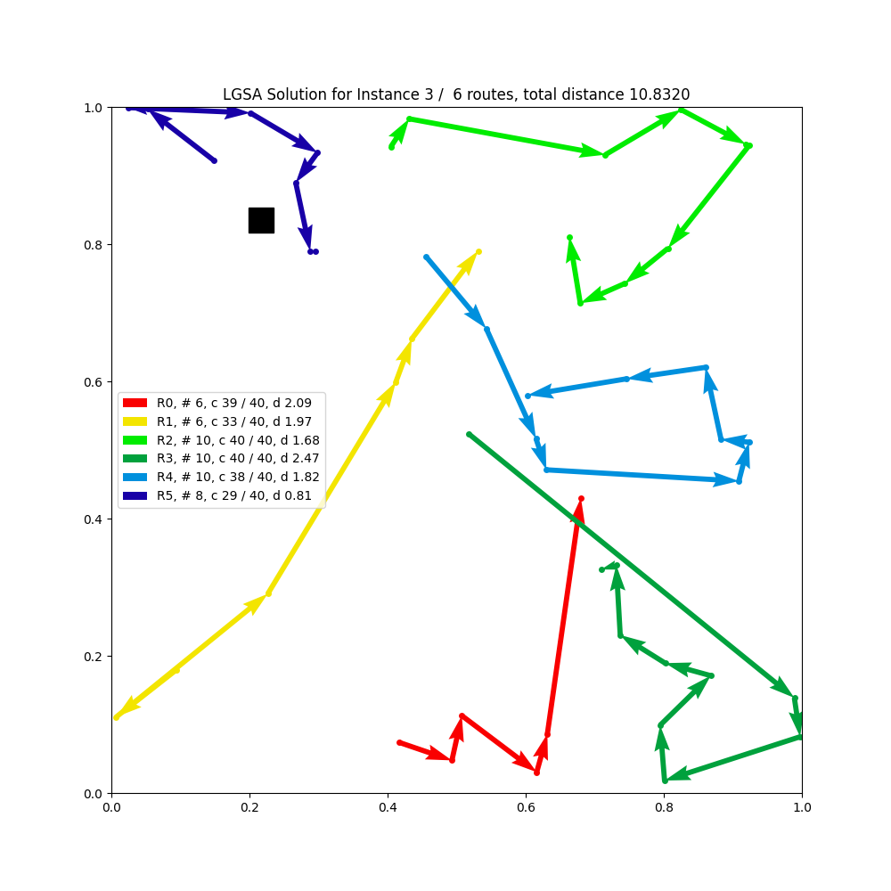
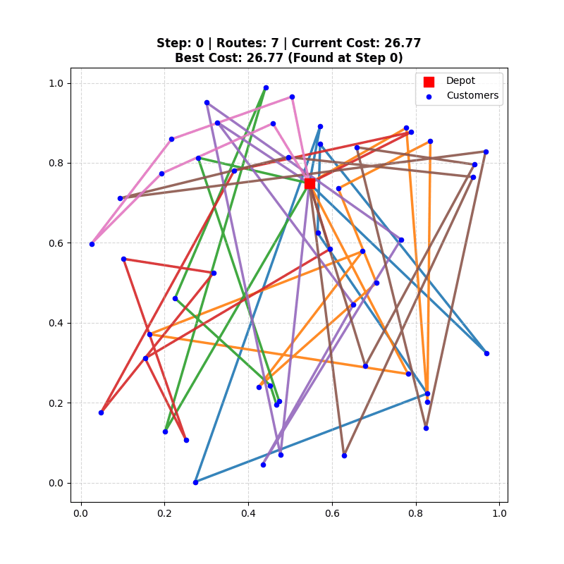

# Learning-Guided Simulated Annealing for the Capacitated Vehicle Routing (LG-SA)

A reinforcement learning framework that solves the **Capacitated Vehicle Routing Problem (CVRP)** by hybridizing **Proximal Policy Optimization (PPO)** with **Simulated Annealing (SA)**. This approach, **LG-SA**, leverages the exploration capabilities of SA and the learnable guidance of a neural policy to find high-quality routing solutions.

## 📌 Overview

Traditional heuristics often struggle to balance exploration and exploitation in large combinatorial spaces. **LG-SA** addresses this by using a neural network (Actor) to propose local moves (like swaps or insetion) within a Simulated Annealing framework. The network is trained via PPO to maximize the probability of accepting improved solutions or minimizing total route cost.


### Example

Here is a visual comparison of different initialization strategies versus the optimized solution found by LG-SA (initialized here with the Random method):

| Initial Solution (Random) | Initial Solution (Nearest Neighbor) | Optimized Solution (LG-SA) |
| :---: | :---: | :---: |
|  |  |  |

Here is an example of the step-by-step improvement of the solution by the LGSA : 


### Key Features

  * **Hybrid Optimization**: Integrates the Metropolis acceptance criterion of Simulated Annealing with a learnable neural proposal distribution.
  * **Deep Reinforcement Learning**: Uses PPO (Proximal Policy Optimization) with Generalized Advantage Estimation (GAE) to train the policy.
  * **Parallel Environment**: Solves hundreds of CVRP instances simultaneously on GPU for efficient training.
  * **Flexible Heuristics**: Supports multiple move operators including `swap`, `insertion`, and mixed strategies.
  * **Adaptive Cooling**: Implements advanced temperature scheduling (Linear, Exponential, Cosine) to manage exploration.
  * **Experiment Tracking**: Native integration with [Weights & Biases](https://wandb.ai/site/) for real-time monitoring of losses, rewards, and solution improvements.

## 🏗️ Project Structure

The project is organized to separate core logic, configuration, and evaluation scripts.

```text
LG-SA/
├── pyproject.toml       # Project metadata and dependencies (uv)
├── uv.lock              # Lock file for reproducible builds
├── launch_HP_sweep.py   # Script for hyperparameter optimization sweeps
├── settings.py          # Script to set up the environment
├── src/                 # Main source code
│   ├── main.py          # Entry point for training
│   ├── problem.py       # CVRP environment & constraints
│   ├── model.py         # Actor (Policy) and Critic (Value) networks
│   ├── ppo/             # PPO algorithm & Replay Buffer
│   ├── sa/              # Simulated Annealing logic
│   ├── HyperParameters/ # YAML configuration files (HP.yaml)
│   ├── setup/           # Initialization & Logger utilities
│   └── utils.py         # Helper functions
├── bdd/                 # Benchmark datasets (Uchoa, Nazari, etc.)
├── evaluation/          # Scripts to test/evaluate models on datasets
├── example/             # An example of LGSA with a trained model
├── generated_nazari_problem/ # generate data following Nazari paper
└── generated_uchoa_problem/ # generate data following Uchoa paper
```

## 🛠️ Installation

This project uses **[uv](https://docs.astral.sh/uv/)** for fast and reliable dependency management, requiring **Python 3.12+**.

### 1\. Prerequisites

Ensure you have `uv` installed. If not:

```bash
pip install uv
```

### 2\. Setup

Clone the repository and initialize the environment:

```bash
# Clone the repository
git clone https://github.com/JAndretti/Learning-Guided-Simulated-Annealing-for-the-Capacitated-Vehicle-Routing.git
cd Learning-Guided-Simulated-Annealing-for-the-Capacitated-Vehicle-Routing

# Install dependencies and setup environment
# This runs settings.py which handles environment creation and optional DB downloads
uv run settings.py
```

*Note: Edit `settings.py` or the configuration if you wish to enable/disable automatic database downloads.*

> **Warning**
> During the development of this project, CVRPLIB updated some of their databases and links. Consequently, some scripts relying on specific URL structures or file formats might not function as expected without modification.

### 3\. WandB Configuration

To enable experiment tracking:

1.  Create a file `src/key.txt`.
2.  Paste your [Weights & Biases API key](https://wandb.ai/settings) into the file.
3.  Alternatively, set `LOG: False` in `src/HyperParameters/HP.yaml` to run without logging.

## 🚀 Usage

### Training

To start a standard training session using the default configuration:

```bash
uv run src/main.py
```

### Hyperparameter Search

To run a sweep (grid search) over hyperparameters:

```bash
uv run launch_HP_sweep.py
```

### Configuration

All hyperparameters are centrally managed in `src/HyperParameters/HP.yaml`. You can modify this file to adjust the experiment.

## 🧠 Methodology

### 1\. The Environment (`problem.py`)

The environment simulates batches of CVRP instances. It manages:

  * **State**: Current vehicle routes, capacities, and visited nodes.
  * **Constraints**: Ensures no vehicle exceeds `MAX_LOAD`.
  * **Initialization**: Supports `random`, `greedy`, and `sweep` initialization strategies.

### 2\. Neural Architecture (`model.py`)

  * **Actor (Policy)**: A neural network that observes the current solution and outputs a probability distribution over possible modification moves (e.g., which node to move and where).
  * **Critic (Value)**: Estimates the quality of the current state, serving as a baseline to reduce variance in gradient updates.

### 3\. Training Loop (SA + PPO)

The training process alternates between experience collection and policy updates:

1.  **Experience Collection (SA Phase)**:

      * The **Actor** proposes a modification to the current route.
      * The **Environment** calculates the change in cost ($\Delta Cost$).
      * **Metropolis Criterion**: The move is accepted if it improves cost OR with probability $e^{-\Delta Cost / T}$ (controlled by temperature $T$).
      * Transitions $(s, a, r, s')$ are stored in a Replay Buffer.

2.  **Policy Update (PPO Phase)**:

      * Transitions are sampled from the buffer.
      * **GAE (Generalized Advantage Estimation)** is computed using the Critic.
      * The Actor and Critic are updated via gradient descent to maximize expected reward (cost reduction) while clipping large policy updates for stability.

